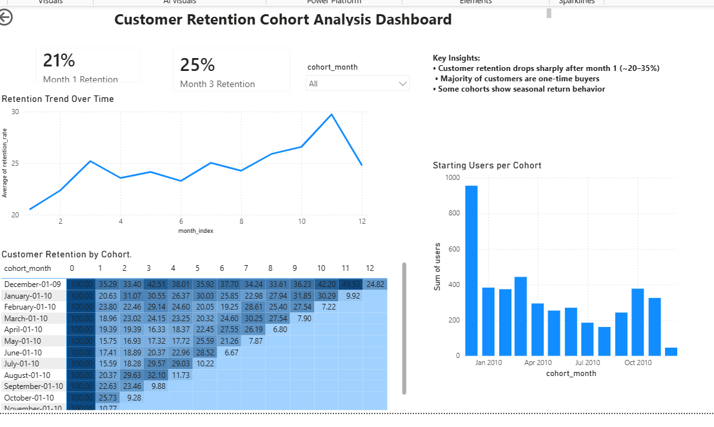

# -Customer-Retention-Cohort-Analysis-Dashboard
This project focuses on analyzing customer behavior through cohort-based retention analysis using SQL and Power BI. The goal is to understand how customers engage over time, identify churn patterns, and derive actionable business insights.
# 📊 Customer Retention Cohort Analysis Dashboard

---

## 🚀 Project Overview

This project analyzes customer purchasing behavior using **cohort-based retention analysis** to understand how customers engage over time and identify churn patterns.

The goal is to transform raw transactional data into **actionable business insights** that support better customer retention strategies.

---

## 🧠 Problem Statement

Businesses often struggle to understand:

- How long customers stay active after their first purchase  
- When customers stop returning (churn)  
- Which customer groups generate long-term value  

This project addresses these questions using **cohort analysis and retention modeling**.

---

## 🛠️ Approach

### 1. Data Preparation (SQL)
- Cleaned raw transactional data by removing:
  - Missing customer IDs  
  - Cancelled orders  
  - Negative quantities (returns)  
- Structured data for time-based analysis  

---

### 2. Cohort Analysis
- Grouped customers by **first purchase month (cohort)**
- Tracked user activity across subsequent months
- Calculated:
  - Retention counts  
  - Retention rates (%)  

---

### 3. Retention Metrics
- Month 1 retention rate  
- Month 3 retention rate  
- Long-term retention trends across cohorts  

---

### 4. Visualization (Power BI)
Developed an interactive dashboard including:

- **Cohort Heatmap** → visualizes retention across time  
- **Retention Trend Line** → shows overall retention behavior  
- **KPI Cards** → highlights key metrics (Month 1 & Month 3 retention)  
- **Cohort Size Chart** → tracks customer acquisition trends  
- **Insight Panel** → summarizes key findings  

---

## 📈 Key Insights

- Customer retention drops sharply after the first month (~20–35%)  
- The majority of customers are **one-time buyers**  
- Retention stabilizes at ~20–30% after Month 3  
- Some cohorts show **seasonal re-engagement**, indicating repeat purchase behavior  

---

## 🛠️ Tools & Technologies

- **SQL (MySQL)** → Data cleaning, cohort logic, retention calculations  
- **Power BI** → Dashboard creation and visualization  
- **Excel / CSV** → Data import and transformation  

---

## 📁 Dataset

- Online Retail dataset (transactional e-commerce data including customer IDs, order dates, and product details)

---

## 💼 Business Value

This analysis helps businesses:

- Identify **churn patterns** and customer drop-off points  
- Understand **customer lifecycle behavior**  
- Improve **retention and re-engagement strategies**  
- Make **data-driven marketing decisions**  

---

## 🏆 Outcome

Built a **professional, end-to-end retention analysis dashboard** that provides clear insight into customer behavior and supports strategic decision-making.

---

## 🔗 Project Highlights

✅ SQL-based data cleaning and transformation  
✅ Cohort-based retention analysis  
✅ Business insight generation  
✅ Interactive Power BI dashboard  

---
